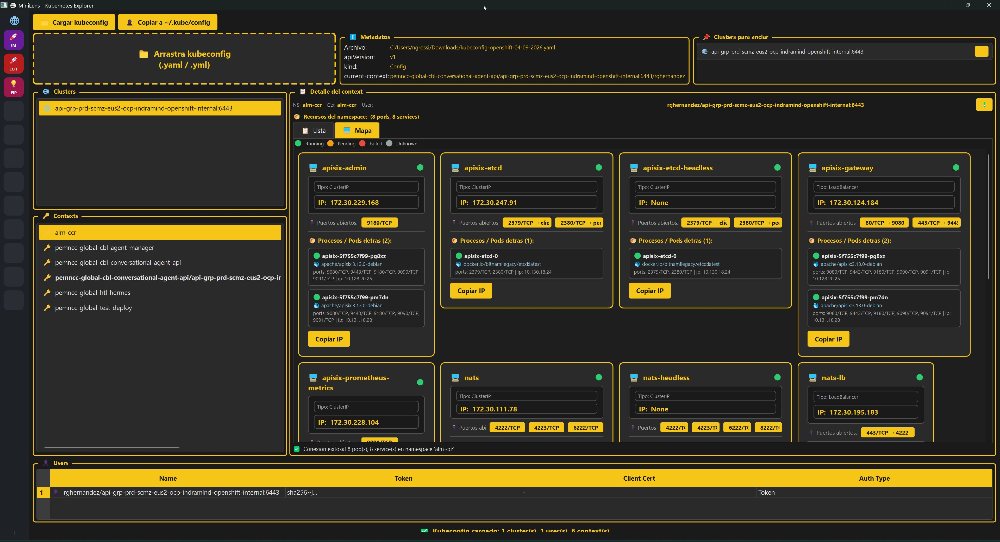

# MiniLens



Visor de **kubeconfig** con **hotbar**, **SQLite** y **vista grafica** de Pods / Services para Kubernetes.

Estilo **OpenLens**: barra lateral izquierda con clusters anclados, tema negro/amarillo, drag & drop de archivos y un mapa grafico de Services + Pods.

---

## Caracteristicas

- **Hotbar** con clusters anclados (estilo OpenLens) — hasta 12 slots.
- **Base de datos SQLite** para guardar kubeconfigs, clusters, contexts y paleta de colores.
- **Drag & drop** de archivos kubeconfig (`.yaml` / `.yml`).
- **Vista de Lista y Mapa grafico** de Services + Pods detras.
- **Tema negro/amarillo** (QSS personalizado).
- **Editor de cluster anclado**: alias, abreviatura, color e icono.
- **Paleta de colores** guardada en la DB (con colores por defecto + random pastel + personalizado).
- **Copiar IP** del Service al portapapeles.
- **Copiar kubeconfig** a `~/.kube/config`.

---

## Requisitos

- Python 3.10+
- Dependencias (ver `requirements.txt`):

```
PySide6==6.8.1
kubernetes==31.0.0
PyYAML==6.0.2
```

---

## Instalacion (desarrollo)

```bash
# 1 - CLONAR / POSICIONARSE EN EL PROYECTO:
cd mini-lens-py

# 2 - CREAR VIRTUAL ENVIRONMENT:
python -m venv venv

# 3 - ACTIVARLO:
#    Windows (cmd):
venv\Scripts\activate
#    Windows (PowerShell):
venv\Scripts\Activate.ps1
#    Linux / macOS:
source venv/bin/activate

# 4 - INSTALAR DEPENDENCIAS:
pip install -r requirements.txt
```

---

## Uso

### Desde el codigo fuente

```bash
# 1 - ACTIVAR EL VENV (si no lo esta):
venv\Scripts\activate

# 2 - EJECUTAR LA GUI:
python Main-GUI.py
```

### Desde el .exe (build portable)

1. Ejecutar el build:
   ```cmd
   CI-CD-LOCAL\generate-minilens-exe.bat
   ```
2. El ejecutable queda en:
   ```
   OUT\MiniLens\MiniLens.exe
   ```
3. Copiar la carpeta `OUT\MiniLens\` completa a otra PC y ejecutar `MiniLens.exe` con doble clic. **No necesita Python instalado.**

---

## Estructura del proyecto

```
mini-lens-py/
├── Main-GUI.py                 # Entry point de la GUI (compilar este)
├── main.py                     # Entry point minimal (solo para pruebas rapidas)
├── requirements.txt            # Dependencias del proyecto
├── database/
│   ├── __init__.py
│   ├── db.py                   # Modulo SQLite (kubeconfigs, clusters, contexts, colors)
│   └── minilens.db             # Base de datos local (se crea automaticamente)
├── ui/
│   ├── __init__.py
│   └── main_window.py          # Ventana principal minimal (main.py)
├── models/
│   └── __init__.py
├── resources/
│   └── __init__.py
├── k8s/
│   └── __init__.py
├── CI-CD-LOCAL/
│   └── generate-minilens-exe.bat   # Build de MiniLens.exe con PyInstaller
├── readme/
│   └── readme.png              # Imagen del README
└── .gitignore
```

---

## Base de datos

SQLite en `database/minilens.db`. Se crea automaticamente en el primer arranque.

### Esquema

| Tabla         | Descripcion                                                       |
|---------------|-------------------------------------------------------------------|
| `kubeconfigs` | Archivos YAML completos + metadatos (apiVersion, kind, etc.)      |
| `clusters`    | Clusters extraidos del kubeconfig, con flag `pinned`, color, etc. |
| `contexts`    | Contexts extraidos del kubeconfig, asociados a clusters           |
| `colors`      | Paleta de colores guardados por el usuario                        |

### Migraciones

El modulo `database/db.py` aplica migraciones automaticas en `init_db()`:
- Agrega las columnas `alias`, `short_alias`, `icon` a `clusters` si no existen.
- Carga colores por defecto si la tabla `colors` esta vacia.

---

## Build del .exe

El script `CI-CD-LOCAL\generate-minilens-exe.bat` hace todo:

1. Verifica Python en el PATH.
2. Crea / activa `venv` e instala dependencias + `pyinstaller`.
3. Limpia builds anteriores (`build/`, `OUT/`, `*.spec`).
4. Construye `MiniLens.exe` con PyInstaller (`--windowed`, sin consola, salida en `OUT/`).
5. Copia `database/minilens.db` junto al `.exe`.

```cmd
CI-CD-LOCAL\generate-minilens-exe.bat
```

---

## CI/CD - GitHub Actions

El workflow `.github/workflows/build-and-release.yml` compila `MiniLens.exe` en Windows y publica un **Release** con la fecha de hoy.

### Triggers
- **Manual**: desde la tab *Actions* en GitHub (*Run workflow*).
- **Tag**: al pushear un tag `v*.*.*` (ej: `git tag v1.0.0 && git push origin v1.0.0`).

### Que hace
1. Checkout + Python 3.12 en `windows-latest`.
2. Instala dependencias + `pyinstaller`.
3. Construye `MiniLens.exe` con PyInstaller (salida en `OUT/`).
4. Copia `minilens.db` junto al `.exe`.
5. Comprime `OUT/MiniLens/` en un `.zip`.
6. Crea un **Release** con tag = fecha de hoy (ej: `2026-09-04`).
7. Sube al release:
   - `MiniLens-<fecha>.zip` (carpeta completa lista para usar)
   - `MiniLens.exe` (ejecutable suelto)

---

## Licencia

Uso interno.
